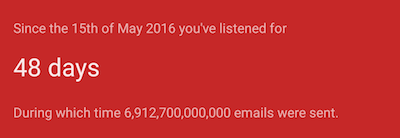

# Audelio
    

## Why Make Another Podcast App

I listen to a lot of podcasts. I found them by searching for keywords in podcast show names, exploring top charts, and hearing recommendations from friends, subreddits, and tweets. But I haven't found a service that recommends podcasts well, allows me to search within podcast descriptions, and allows me to share episodes with friends in a simple format.

Where is the podcast industry's version of [Spotify's Discover Weekly](https://gizmodo.com/spotifys-new-discover-weekly-playlist-knows-you-so-we-1718992287)? I don't know, but this is my attempt to create one.

**I have one goal for this project**: Create an algorithm that finds me incredible podcasts that I wouldn't have found otherwise.

## The Stack

**Tentative and incomplete**

- React
  - Create React App
  - Styled Components
  - React Player
- Apollo
- GraphQL
- testing
  - Jest
  - Enzyme
  - Codecov
  - TravisCI
